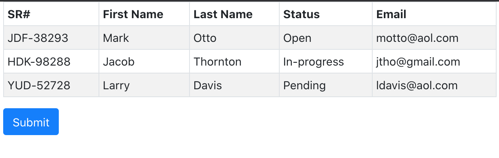

## Overview

This is a React App that has been adapted to run in Liferay DXP using, for details see <a href="https://help.liferay.com/hc/en-us/articles/360035467712-Adapting-Existing-Apps-to-Run-on-Liferay-DXP" target="_self">Liferay Tooling</a>



## Available Scripts for React

In the project directory, you can run:

### `yarn start`

Runs the app in the development mode.<br />
Open [http://localhost:3000](http://localhost:3000) to view it in the browser.

The page will reload if you make edits.<br />
You will also see any lint errors in the console.

### `yarn build`

Builds the app for production to the `build` folder.<br />
It correctly bundles React in production mode and optimizes the build for the best performance.

The build is minified and the filenames include the hashes.<br />
Your app is ready to be deployed!

## Available Scripts for Liferay
<p> *** Update the local Liferay bundle path *** </p>
<p> Navigate to the root directory of the project, edit the .npmbuildrc file to point to your local Liferay DXP bundle, i.e. /Users/liferay/ </p>

Once updates have been made to the React application, you can run the npm build command to prepare the project for deployment to DXP.
```console
npm run build:liferay
```

After a successful build, run the deploy command
```console
npm run deploy:liferay
```